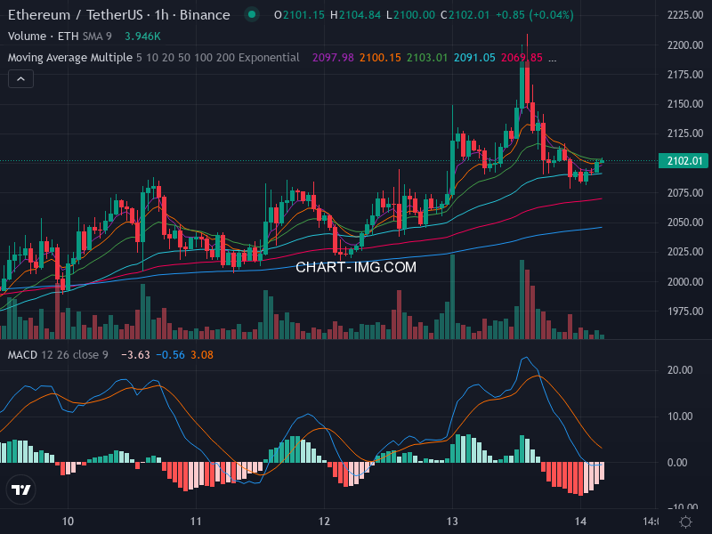

# Crypto Analysis Bot (Python + GitHub Actions)

這是一個自動化加密貨幣技術分析機器人，使用 Python 撰寫並整合 GitHub Actions 自動化執行。
程式會自動產生 TradingView 技術線圖，利用 GitHub Models (GPT-4o) 進行 AI 趨勢解讀，並將圖表與報告即時推送到 Telegram。

## 最新技術分析圖表 (Latest Analysis)

*(此圖表會隨 GitHub Action 執行自動更新)*

## 主要功能
- **自動繪圖**: 整合 `chart-img.com` API 繪製包含 EMA 與 MACD 指標的專業線圖。
- **AI 分析**: 透過 OpenAI SDK 連接 **GitHub Models (GPT-4o)** 進行影像識別與趨勢判斷。
- **Telegram 推送**: 分析完成後自動發送圖文報告至指定群組。
- **Agentic Skill**: 封裝為標準 Skill 格式，可供 AI Agent 直接調用。

## 關於 Chart Img API

本專案的核心繪圖功能由 **[chart-img.com](https://chart-img.com/)** [提供](https://chart-img.com/#pricing)。
這是一個專業的 TradingView 圖表生成服務，允許開發者透過 API 產生高解析度的金融市場圖表。

在本專案中的配置如下：
- **圖表類型**: TradingView Advanced Chart (Dark Theme)
- **技術指標 (Indicators)**:
  1. **Volume**: 成交量，判斷市場活絡度。
  2. **Moving Average Multiple (EMA)**: 多重指數移動平均線 (EMA 5, 10, 20)，用於判斷短期趨勢方向。
  3. **MACD**: 平滑異同移動平均線，用於判斷動能與買賣訊號。
- **特點**: 產生的圖片包含完整座標軸與指標數據，非常適合讓 AI (如 GPT-4o Vision) 進行影像辨識與技術分析。

## 如何使用

### 1. 環境設定 (Environment Setup)
請複製 `.env.example` 為 `.env` 並填入您的設定：
```ini
CHART_IMG_API_KEY=your_key
TELEGRAM_BOT_TOKEN=your_token
TELEGRAM_CHAT_ID=your_chat_id
GH_TOKEN=your_github_token
```

### 2. 本地執行 (Local Run)
```bash
pip install -r requirements.txt
python analyze_chart.py
```

### 3. 使用 Skills (Agent Use)
本專案已整合為 Agent Skill，位於 `.agent/skills/crypto_analysis`。
您可以直接對 AI Agent 下指令：
> "幫我分析 ETH 的走勢"
> "執行 crypto analysis"

### 4. GitHub Actions 自動化
專案內建 GitHub Action (`.github/workflows/crypto_analysis.yml`)，預設**每 4 小時**自動執行一次。
請記得在 GitHub Repository 的 Secrets 中設定對應的環境變數。

## 專案結構
- `analyze_chart.py`: 核心邏輯腳本。
- `.agent/skills/`: Agent 專用的 Skill 定義檔。
- `.github/workflows/`: 自動化排程設定。