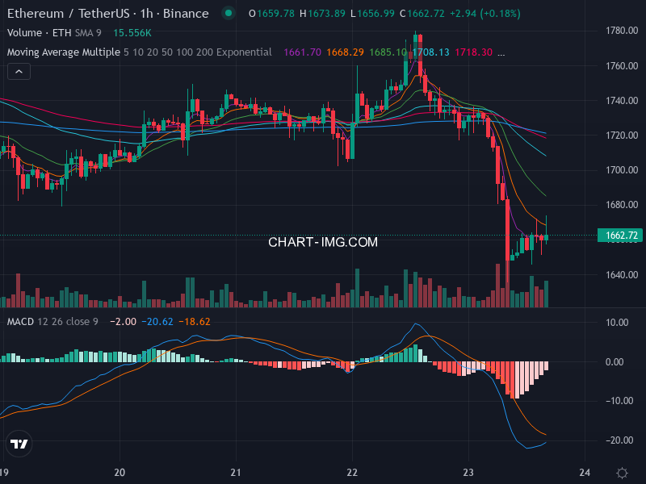

# Crypto Analysis Bot (Python + GitHub Actions)

這是一個自動化加密貨幣技術分析機器人，使用 Python 撰寫並整合 GitHub Actions 自動化執行。
程式會自動產生 TradingView 技術線圖，從幣安 API 取得精確指標數值，透過 **NVIDIA NIM (LLaMA 3.3 70B)** 進行 AI 趨勢解讀，並將圖表與報告即時推送到 Telegram。

## 最新技術分析圖表 (Latest Analysis)
  
*Last Analysis: 2026-05-08 04:59:28 UTC*

## 主要功能
- **自動繪圖**: 整合 `chart-img.com` API 繪製包含 EMA 與 MACD 指標的專業線圖（深色主題）。
- **精確指標計算**: 直接從幣安 API 取得 K 線數據，以 Python 計算 EMA5/10/20/50/100 及 MACD(12,26,9)，確保數值準確。
- **AI 分析**: 透過 **NVIDIA NIM**（`meta/llama-3.3-70b-instruct`）解讀指標並生成繁體中文技術分析報告。
- **Telegram 推送**: 分析完成後自動發送圖表與格式化報告（HTML 粗體）至指定群組。
- **Agentic Skill**: 封裝為標準 Skill 格式，可供 AI Agent 直接調用。

## 技術架構

```
幣安 Klines API ──► Python 計算 EMA / MACD ──► NVIDIA NIM (LLaMA 3.3) ──► Telegram
chart-img.com   ──► TradingView 圖表 ──────────────────────────────────► Telegram
```

- **數值由 Python 計算**（不依賴 AI 讀圖），確保 EMA、MACD 判斷邏輯正確
- **AI 僅負責撰寫報告文字**，不做數值讀取，消除視覺辨識誤判問題

## 分析指標說明

| 指標 | 參數 | 用途 |
|------|------|------|
| EMA | 5 / 10 / 20 / 50 / 100 | 均線排列判斷多頭/空頭/糾結 |
| MACD | 快線12 / 慢線26 / Signal9 | 金叉/死叉與動能方向 |

**均線排列定義**
- 多頭排列：收盤價 > EMA5 > EMA10 > EMA20
- 空頭排列：收盤價 < EMA5 < EMA10 < EMA20
- 均線糾結：不符合以上兩者

**操作建議規則**
- 多頭排列 + 金叉 → 強力買入 / 買入
- 多頭排列 + 死叉 → 中立
- 均線糾結 → 中立
- 空頭排列 + 死叉 → 強力賣出 / 賣出
- 空頭排列 + 金叉 → 中立

## 如何使用

### 1. 環境設定

複製 `.env.example` 為 `.env` 並填入：

```ini
CHART_IMG_API_KEY=your_key        # https://chart-img.com/
TELEGRAM_BOT_TOKEN=your_token     # @BotFather
TELEGRAM_CHAT_ID=your_chat_id     # @userinfobot 查詢
NVIDIA_API_KEY=nvapi-...          # https://build.nvidia.com/
SYMBOL=ETHUSDT                    # 監控幣種（選填）
INTERVAL=1h                       # K 線週期（選填）
```

### 2. 安裝套件

```bash
pip install -r requirements.txt
```

### 3. 本地執行

完整流程（抓圖 + 分析 + 推送）：
```bash
python analyze_chart.py
```

僅重新分析現有圖表（不重抓，節省 API 次數）：
```bash
python analyze_chart.py --analyze-only
```

### 4. GitHub Actions 自動化

專案內建排程（`.github/workflows/crypto_analysis.yml`），預設每 **4 小時**自動執行。
請在 Repository → Settings → Secrets 設定以下變數：

| Secret | 說明 |
|--------|------|
| `CHART_IMG_API_KEY` | chart-img.com API Key |
| `TELEGRAM_BOT_TOKEN` | Telegram Bot Token |
| `TELEGRAM_CHAT_ID` | Telegram Chat ID |
| `NVIDIA_API_KEY` | NVIDIA NIM API Key |

### 5. Agent Skill

本專案封裝為 Agent Skill（`.agent/skills/crypto_analysis`），可直接對 AI Agent 下指令：
> "幫我分析 ETH 的走勢"
> "執行 crypto analysis"

## 專案結構

```
.
├── analyze_chart.py          # 核心邏輯（繪圖、計算指標、AI 分析、Telegram 推送）
├── latest_chart.png          # 最新圖表（自動更新）
├── .env.example              # 環境變數範本
├── requirements.txt          # Python 套件
├── .agent/skills/            # Agent Skill 定義
└── .github/workflows/        # GitHub Actions 排程
```

## 相依套件

```
requests        # HTTP 呼叫（幣安 API、chart-img、Telegram）
openai          # NVIDIA NIM API（OpenAI 相容介面）
python-dotenv   # 讀取 .env 設定
```
